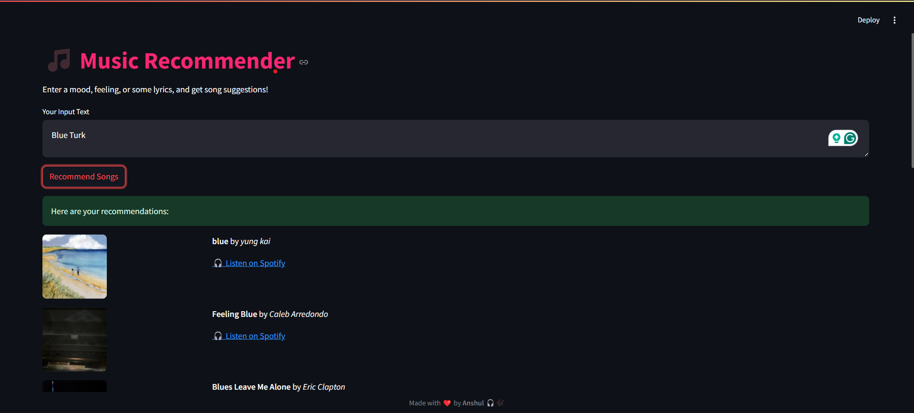

# 🎵 Music Recommender 🎧

A smart and intuitive music recommendation app that suggests songs based on **your mood**, **feelings**, or **custom lyrics**. Just type a sentence, and let the app find the perfect match from over 57000 songs --- complete with Spotify previews!

---

## ✨ Features

- 🔍 **Text-Based Recommendations**  

  Leverages **TF-IDF** and **cosine similarity** to understand your input and match it to song lyrics.

- 🧠 **Lyrics Dataset Integration**  

  Uses the [Millsong Dataset](https://www.kaggle.com/datasets/gyani95/380000-lyrics-from-metrolyrics) for an extensive collection of lyrics.

- 🎧 **Spotify Web API Integration**  

  Fetches:

  - 🎵 Song titles  

  - 🎤 Artist names  

  - 💽 Album previews (when available)  

  - 🔗 Direct Spotify links for listening

- 🌙 **Sleek Streamlit UI**  

  - Minimalist and responsive design  

  - Dark mode friendly 🌌

---

## 🚀 Getting Started

### 1. Clone the Repository

git clone https://github.com/yodamynameis/Music_Recommender.git

cd Music_Recommender

### 2\. Install Dependencies

Make sure you have Python 3.7+ installed. Then run:

bash

Copy

Edit

pip install -r requirements.txt

### 3\. Set Up Spotify API

Go to the Spotify Developer Dashboard

**SPOTIFY_CLIENT_ID** =your_client_id_here

**SPOTIFY_CLIENT_SECRET** =your_client_secret_here

## 🧪 How It Works

Enter a sentence, phrase, or lyrics snippet into the input box.

The app uses **TF-IDF vectorization** to represent your text.

It computes **cosine similarity** with song lyrics from the dataset.

The top similar songs are fetched and enhanced with Spotify data.

📸 Screenshot

📂 Dataset Info

Dataset: Millsong Dataset

Format: CSV

Fields used: song_id, song, artist, lyrics

🛠️ Tech Stack

Python 🐍

Streamlit ⚡

Scikit-learn 🧠

Spotify Web API 🎶

Pandas & NumPy 🧮

🤝 Contributing

Contributions are welcome!

Feel free to fork the repo, open issues, or submit pull requests to help improve the project.
